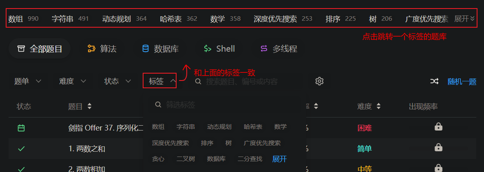
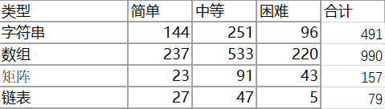
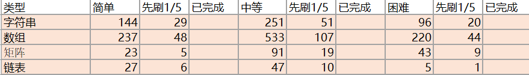

LeetCode刷题建议见[文章](https://zhuanlan.zhihu.com/p/380242861)。

下面介绍“LeetCode刷题统计”表格。

## 表单介绍

- 算法-数据结构/算法/技巧/题：我对LeetCode算法类题的进一步的划分。

- 数据库/Shell/多线程：LeetCode这三类题的统计。

  

- 汇总：上两类表单的汇总。

- 一轮：分轮刷题使用样例。

## 表格制作过程

目前LeetCode一个标签下的题目，只显示了这个标题的总题数。

首先，我统计了每个标签不同难度的题目。

然后，按照自己的顺序对标签进行了排序。

最后，确定刷题数，就可以使用表格记录刷题情况了。

